# PM DeepResearch — 产品与技术架构文档

> 版本: v1.2.0 (当前) → v1.3.0 (规划中)
> 日期: 2026-05-21
> 维护者: Runa798

---

## 1. 产品定位

PM DeepResearch 是一个 Claude Code Skill，面向**专业产品经理和运营专家**，将多模型编排与产品研究方法论融合为一套完整的深度调研系统。

### 1.1 核心价值主张

| 维度 | 竞品（ChatGPT Deep Research / Perplexity） | PM DeepResearch |
| ---- | ---- | ---- |
| 研究方法论 | 无结构化方法论 | MECE 6维 + 3研究人格 + Gap迭代 |
| 工具精准度 | 单一搜索引擎 | Grok + Exa + Gemini + Browser 四层 |
| 成本控制 | 全部用大模型 | 分层模型，FAST层成本降低37x |
| 输出质量 | 信息罗列 | 可行动决策建议 + 多框架分析 |
| 集成方式 | 独立产品 | Claude Code Skill，嵌入开发者工作流 |

### 1.2 目标用户

```
PM / 运营专家
    │
    ├── 日常使用 Claude Code 做开发+调研
    ├── 需要产业级深度分析（竞品/市场/用户）
    ├── 关注研究质量而非速度
    └── 愿意配置工具以获得更好结果
```

### 1.3 三大核心问题

| # | 问题 | 根因 | 解决方案 |
| - | ---- | ---- | -------- |
| 1 | MCP工具调用不精准 | Skill prompt缺工具路由指令 | PM Persona Pack + 工具分配矩阵 |
| 2 | Token浪费 | 主模型做低价值抓取 | 分层模型 + CLI/Subagent委托 |
| 3 | 开放性问题缺深度 | 缺研究方法论 | MECE范围扩展 + Gap驱动迭代 |

---

## 2. 系统架构

### 2.1 整体架构图

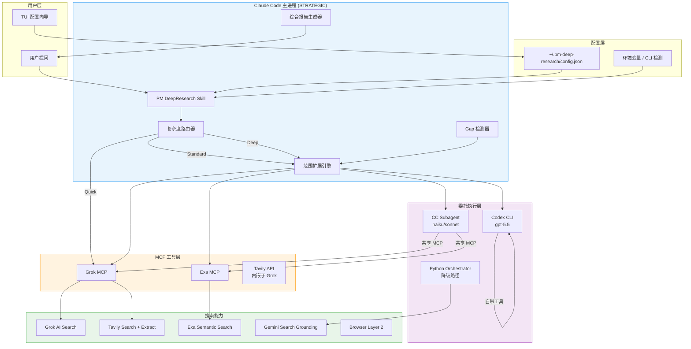

### 2.2 模型分层架构

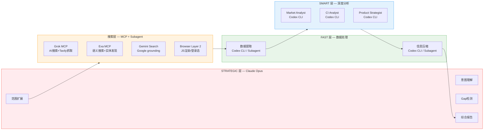

### 2.3 模型调用三级优先级

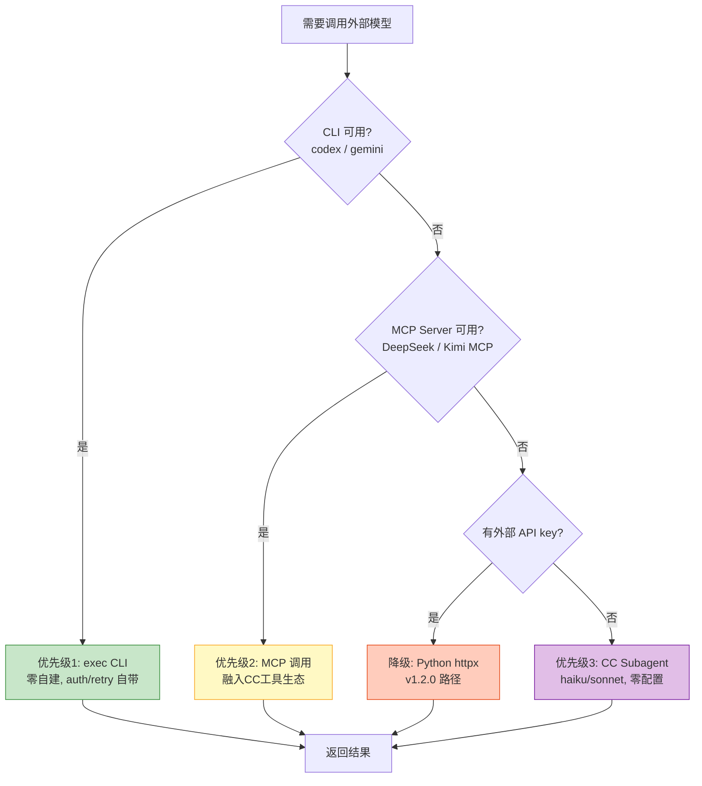

---

## 3. 数据流与泳道图

### 3.1 Deep 级调研完整泳道图 (v1.3.0 目标架构)

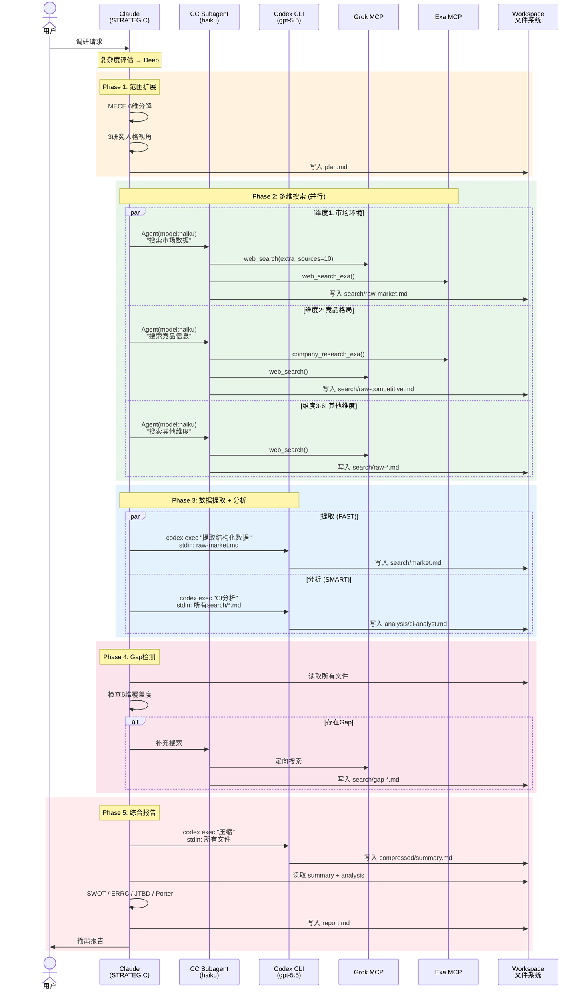

### 3.2 搜索层内部流程

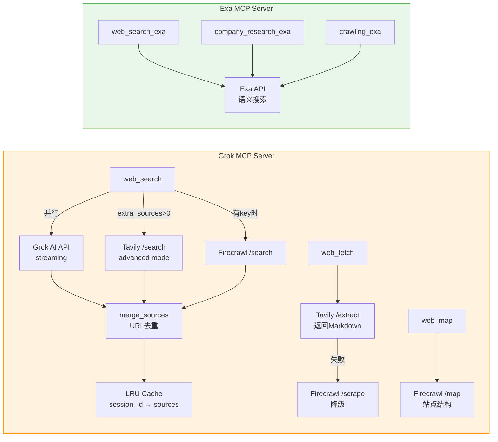

### 3.3 v1.2.0 vs v1.3.0 执行模型对比

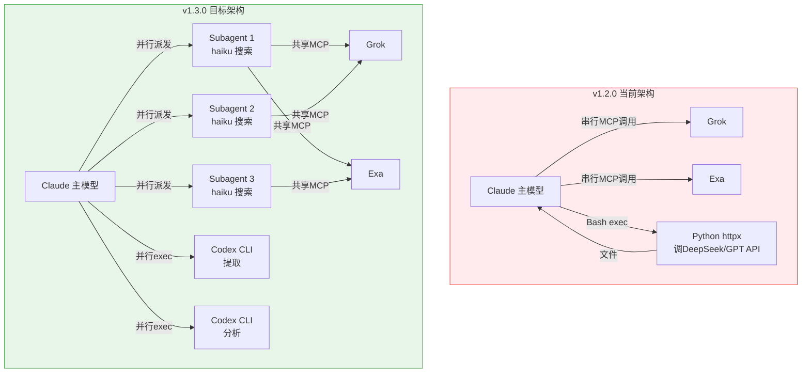

---

## 4. 任务类型 × 执行方案矩阵

### 4.1 按任务类型选择执行方式

| 任务类型 | 需要MCP? | 最优方案 | 降级方案 | 原因 |
| -------- | -------- | -------- | -------- | ---- |
| 搜索抓取 | ✅ 必须 | CC Subagent (haiku) | Claude 主模型直调 | 共享 Grok/Exa MCP |
| 数据提取 | ❌ | Codex CLI (gpt-5.5) | Python httpx → DeepSeek | 纯文本处理，无需MCP |
| 人格分析 | ❌ | Codex CLI (gpt-5.5) | Python httpx → GPT | 需要推理能力，不需要MCP |
| 信息压缩 | ❌ | Codex CLI 或 Subagent (haiku) | Python httpx → DeepSeek | 结构化转换 |
| 补充搜索 | ✅ | CC Subagent (haiku) | Gemini Search API | 需要 MCP 或独立搜索能力 |
| 最终综合 | ❌ | Claude 主模型 (Opus) | 不可降级 | 最高质量要求 |

### 4.2 硬约束

```
┌─────────────────────────────────────────────────────┐
│  搜索/抓取类 agent 必须具备网页抓取能力              │
│                                                     │
│  ✅ CC Subagent → 共享会话 MCP (Grok/Exa)           │
│  ✅ Codex CLI   → 自带 web 工具                     │
│  ✅ MCP Server  → 取决于具体 MCP 设计               │
│  ❌ 纯对话模型  → 不满足要求                        │
└─────────────────────────────────────────────────────┘
```

---

## 5. 配置与 TUI 架构

### 5.1 配置层级

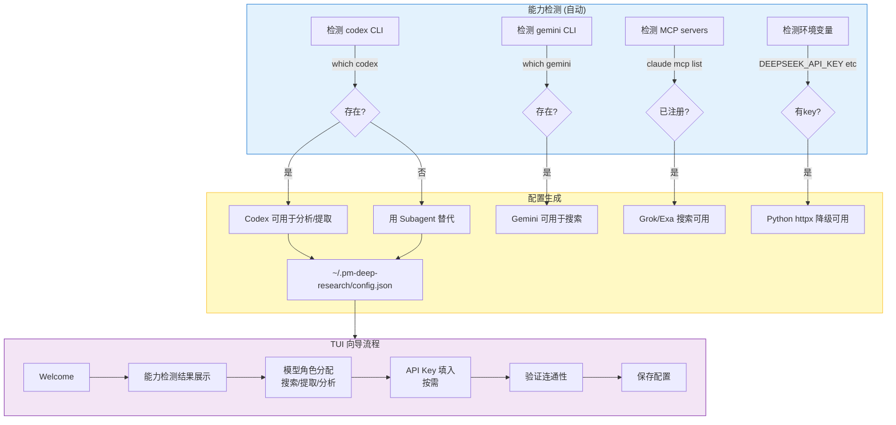

### 5.2 config.json 结构 (v1.3.0)

```json
{
  "version": "1.3.0",
  "execution": {
    "search": {
      "method": "subagent",
      "model": "haiku",
      "fallback": "claude-direct"
    },
    "extract": {
      "method": "codex-cli",
      "model": "gpt-5.5",
      "fallback": "subagent-haiku"
    },
    "analyze": {
      "method": "codex-cli",
      "model": "gpt-5.5",
      "fallback": "subagent-sonnet"
    },
    "compress": {
      "method": "codex-cli",
      "model": "gpt-5.5",
      "fallback": "subagent-haiku"
    }
  },
  "mcp": {
    "grok": { "registered": true },
    "exa": { "registered": true }
  },
  "cli": {
    "codex": { "available": true, "path": "/home/user/.npm-global/bin/codex" },
    "gemini": { "available": false }
  },
  "api_keys": {
    "deepseek": { "configured": true },
    "openai": { "configured": true }
  },
  "features": {
    "scope_expansion": true,
    "gap_iteration": true,
    "gemini_search": false
  }
}
```

---

## 6. Workspace 文件协议

```
workspace/research-{YYYY-MM-DD}-{slug}/
│
├── plan.md                    # Claude 写: 研究计划 + MECE 6维分解
├── state.json                 # 系统更新: 阶段跟踪
│
├── search/                    # 搜索结果
│   ├── raw-{dimension}.md     # Subagent 写: 原始 MCP 搜索结果
│   ├── {dimension}.md         # Codex CLI 写: 结构化提取数据
│   ├── gemini-{topic}.md      # Gemini 写: grounding 搜索结果
│   └── gap-{dimension}.md     # Subagent 写: 补充搜索结果
│
├── analysis/                  # 分析结果
│   ├── market-analyst.md      # Codex CLI 写: 市场分析
│   ├── ci-analyst.md          # Codex CLI 写: 竞争情报分析
│   └── product-strategist.md  # Codex CLI 写: 产品策略分析
│
├── compressed/
│   └── findings-summary.md    # Codex CLI 写: 压缩后的综合摘要
│
├── errors.log                 # 系统追加: 错误记录
└── report.md                  # Claude 写: 最终研究报告
```

---

## 7. 研究方法论

### 7.1 MECE 6 维度范围扩展

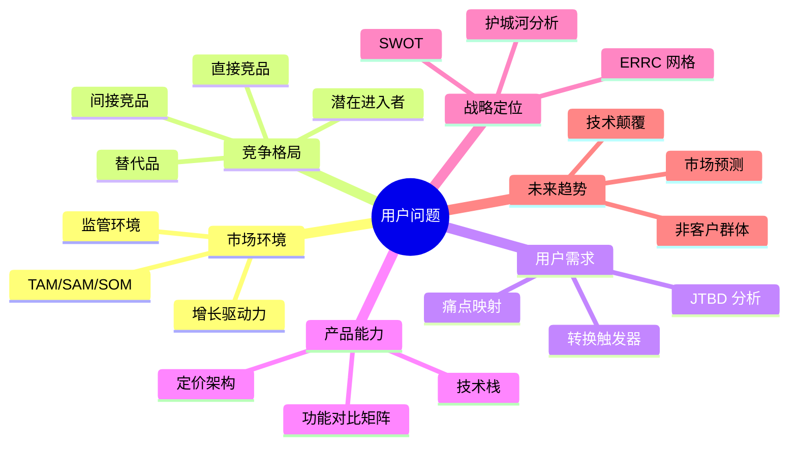

### 7.2 三研究人格

| 人格 | 聚焦 | 分析框架 | 对应维度 |
| ---- | ---- | -------- | -------- |
| Market Analyst | 市场规模/趋势/风险 | TAM/SAM/SOM, 增长驱动力 | 1.市场 + 6.趋势 |
| CI Analyst | 竞品/定位/护城河 | Porter五力, 特征矩阵, 护城河分析 | 2.竞品 + 4.产品 |
| Product Strategist | 用户需求/机会/建议 | JTBD, Blue Ocean ERRC, OST | 3.用户 + 5.战略 |

### 7.3 Gap 驱动迭代

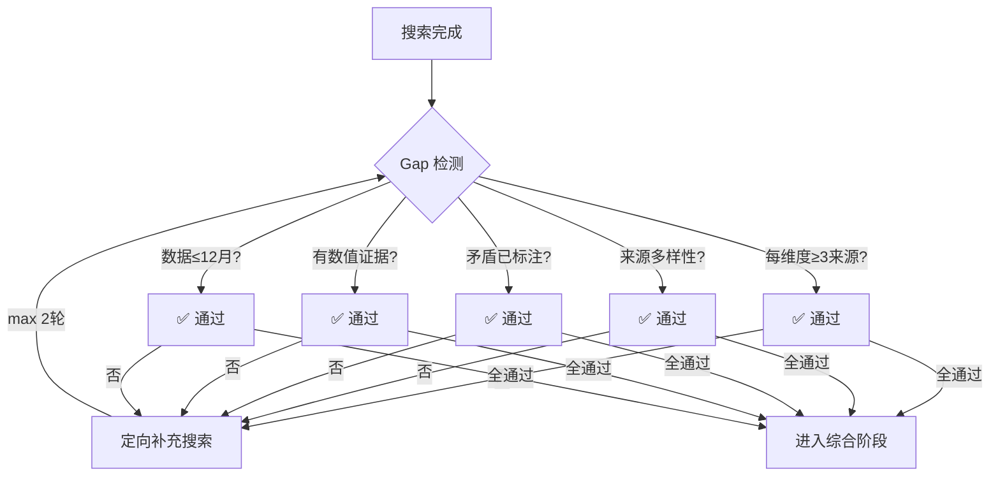

---

## 8. 优雅降级矩阵

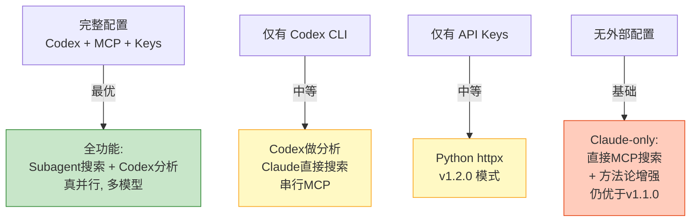

| 条件 | 行为 |
| ---- | ---- |
| 无 config.json | Claude-only + MECE方法论增强 |
| 仅 Codex CLI | 分析/提取委托Codex，搜索Claude直做 |
| 仅 API keys | v1.2.0 Python httpx 模式 |
| Codex + MCP | Subagent搜索 + Codex分析 (最优) |
| 外部API超时 | 记录error.log，Claude自行完成该步骤 |
| MCP不可用 | Subagent用CC内置WebSearch降级 |

---

## 9. 版本路线图

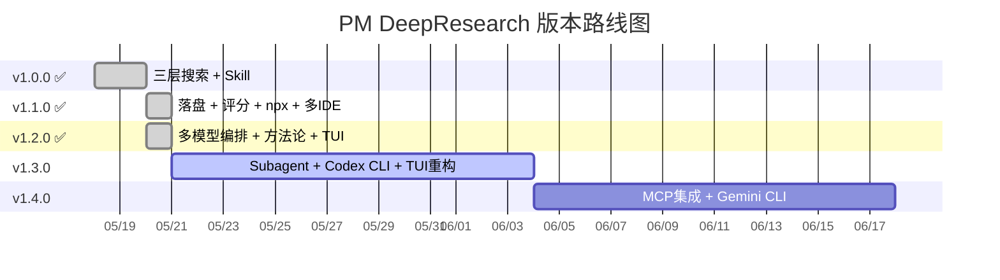

### v1.3.0 范围

| 模块 | 内容 | 优先级 |
| ---- | ---- | ------ |
| CC Subagent 搜索 | 用 haiku/sonnet subagent 并行搜索，共享 MCP | P0 |
| Codex CLI 分析 | 用 codex exec 做提取/分析/压缩 | P0 |
| TUI 重构 | 能力发现向导，检测 CLI/MCP/Key | P0 |
| Skill 层重写 | 从 python orchestrator 调用改为 CLI/subagent 编排 | P0 |
| Python 包精简 | 退化为 TUI + config + 能力检测 | P1 |

### v1.4.0 范围 (待定)

| 模块 | 内容 | 依赖 |
| ---- | ---- | ---- |
| DeepSeek MCP | 通过 MCP 调用 DeepSeek | Heye 的 MCP 研究 |
| Gemini CLI grounding | 验证 gemini CLI 是否支持 search grounding | CLI 功能验证 |
| Quality Gates | Hook 机制，研究各阶段自动检测质量 | v1.3.0 稳定 |
| 中文生态 | Bocha 搜索 + 微信公众号 MCP | 独立集成 |

---

## 10. 关键技术决策记录

| # | 决策 | 选择 | 理由 |
| - | ---- | ---- | ---- |
| 1 | 主模型调用方式 | Claude 就是主模型，不通过 API 调 | Claude Code CLI 本身就运行在 Claude 上 |
| 2 | 外部模型调用 | CLI > MCP > Subagent > httpx | 利用生态工具，减少自建代码 |
| 3 | 搜索 agent 实现 | CC Subagent (haiku) | 共享 MCP 工具，零额外配置 |
| 4 | 分析任务实现 | Codex CLI (gpt-5.5) | 不需要 MCP，纯文本处理，可真并行 |
| 5 | IPC 方式 | Workspace 文件系统 | 可靠、可恢复、可追溯 |
| 6 | 配置存储 | ~/.pm-deep-research/config.json | 全局用户级，权限 0600 |
| 7 | 框架 | 无 (不用 LangChain/CrewAI) | 是 CC Skill 不是独立 agent |
| 8 | Context 压缩 | 55% 保留率，35% 硬底线 | Chen et al. 2025 研究 |
