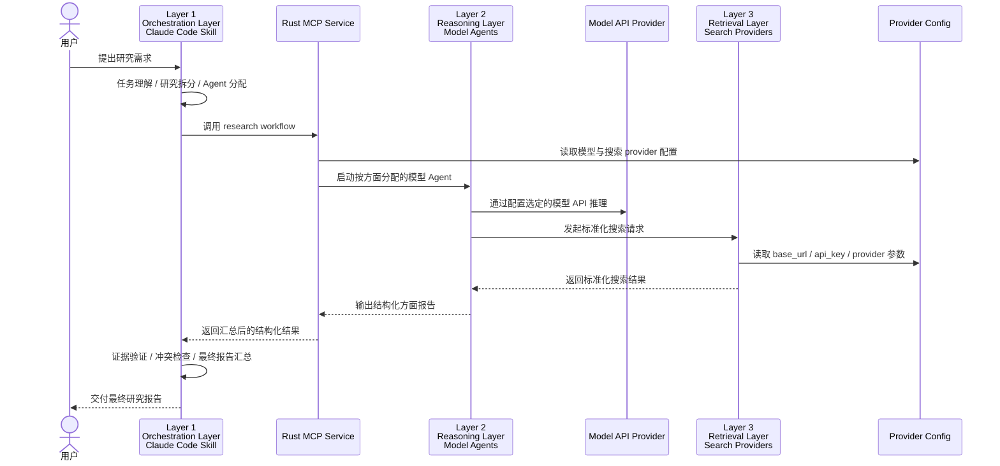
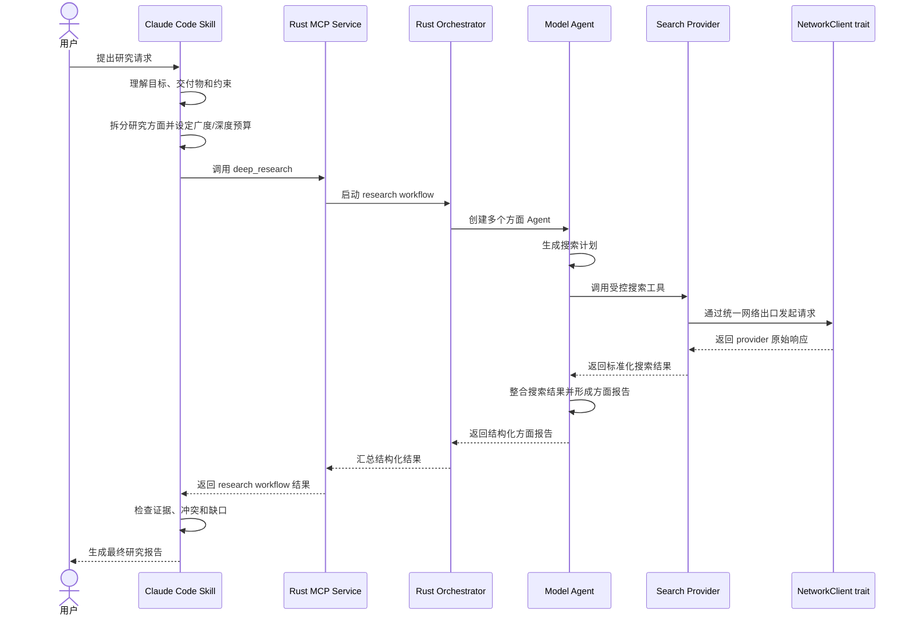
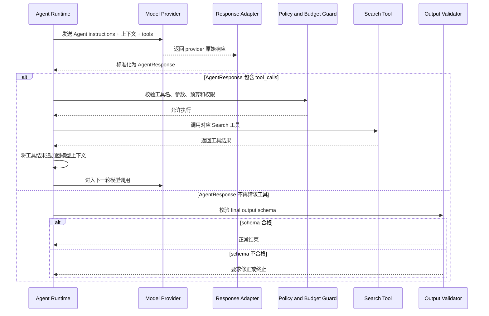
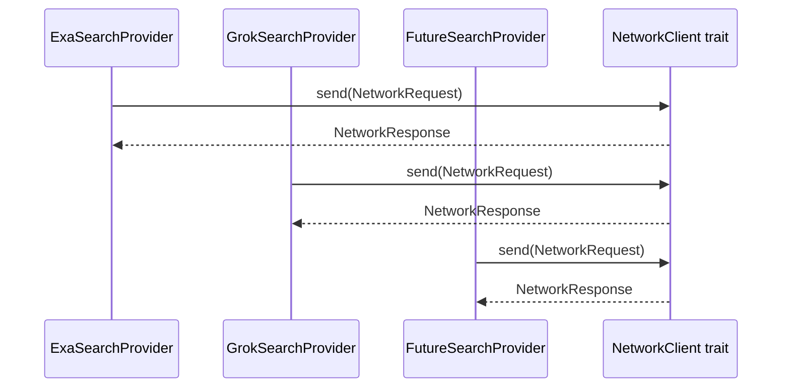
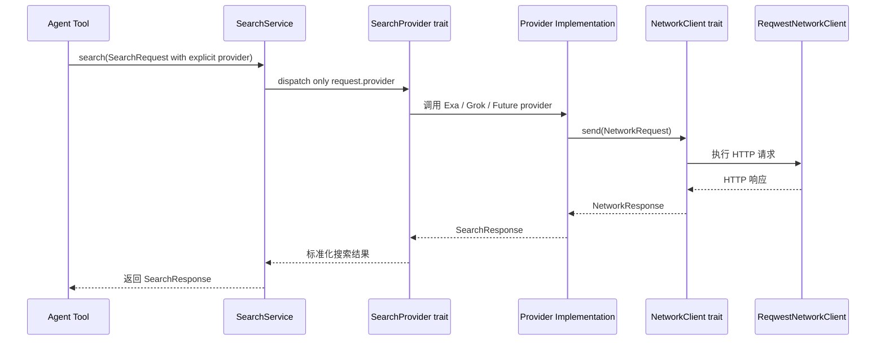

# Lapis Research Agent 产品文档

## 1. 产品摘要

Lapis 是一个面向产品经理、战略分析师、行业研究人员、创业者和技术负责人等研究型用户的深度调研 Agent 产品。它的目标是帮助用户在一个问题上同时获得足够的覆盖广度和分析深度：既能广泛检索多源信息，又能按不同分析视角组织多个模型 Agent 进行推理、交叉验证和报告汇总。

Lapis 的核心形态不是一个通用聊天机器人，而是一个嵌入 Claude Code 工作流的研究编排系统。Claude Code 中的 Skill 作为主分析者和总调度者，将用户的研究目标拆解为多个方面；Rust 构建的 MCP 服务承接底层模型 Agent 编排、模型 API provider 调用和搜索 provider 调用；Exa Search、Grok Search 等搜索 API 作为纯搜索能力提供者。

## 2. 目标用户

### 2.1 产品经理

产品经理需要在市场、用户、竞品、技术趋势、商业模式和风险之间建立完整判断。单次搜索通常只能回答局部问题，而 Lapis 通过多 Agent 分工帮助产品经理同时覆盖多个分析维度。

典型需求：

- 调研某个新产品方向是否值得进入。
- 对比多个竞品的定位、功能、定价和增长策略。
- 梳理行业趋势、用户痛点和机会空间。
- 为 PRD、Roadmap 或战略讨论准备高质量背景材料。

### 2.2 战略与行业分析人员

这类用户更关注信息覆盖、来源可信度、长期趋势和不同观点之间的冲突。Lapis 需要支持多源检索、证据归因和观点整合。

### 2.3 创业者与技术负责人

这类用户通常需要快速理解一个市场、技术路线或生态格局，并形成可执行判断。Lapis 应当将搜索、归纳、风险识别和行动建议统一到一个报告工作流中。

## 3. 用户问题

现有调研流程通常存在以下问题：

1. **广度不足**：用户容易围绕最初几个关键词反复搜索，遗漏相邻市场、替代方案或反方证据。
2. **深度不足**：搜索结果往往停留在摘要层面，缺少按业务、技术、用户、风险等维度的深入分析。
3. **来源分散**：搜索 API、网页、社交讨论、官方文档和行业报告之间缺乏统一整理。
4. **结论不可追溯**：最终报告中的判断经常缺少清晰证据来源。
5. **分析角色单一**：单个模型容易沿着一个思路完成回答，缺少多视角互补。
6. **复用性差**：每次调研都需要重新设计 prompt、搜索关键词和报告结构。

Lapis 通过三层架构解决这些问题：Layer 1（Orchestration Layer）负责主控与任务拆解，Layer 2（Reasoning Layer）负责多方面推理，Layer 3（Retrieval Layer）负责搜索能力。

## 4. 产品目标

Lapis 的产品目标包括：

- **广度覆盖**：自动拆出多个研究方向，避免只围绕单一关键词搜索。
- **深度分析**：每个模型 Agent 针对特定方面进行多步搜索、推理和整合。
- **证据可追溯**：重要结论必须保留来源、摘要和置信度。
- **多视角综合**：支持市场、用户、竞品、技术、商业、风险等不同视角并行分析。
- **可控编排**：Claude Code Skill 作为主分析者，负责拆解、分配、验收和最终汇总。
- **模型可替换**：Reasoning Layer 不绑定 GPT，可通过配置选择 `openai`、Anthropic-compatible 或其他模型 API provider。
- **搜索可扩展**：Retrieval Layer 搜索 API provider 可独立替换或扩展，不影响上层 Agent 编排。
- **Rust 核心可靠性**：MCP、模型 Agent 编排、模型 provider 和搜索 provider 层由 Rust 构建，保证边界清晰、类型明确和可维护性。

## 5. 非目标

Lapis 在当前阶段不追求以下能力：

- 不做通用聊天机器人。
- 不直接提供完整 Web UI。
- 不承诺搜索结果实时性超过底层 provider 能力。
- 不限定 Reasoning Layer 只能使用 GPT 或单一模型厂商。
- 不让模型 Agent 直接访问任意网络或任意文件系统。
- 不把模型 API、Exa Search、Grok Search 等 provider 逻辑泄露给 Orchestration Layer。
- 不在 MVP 阶段实现复杂知识库、长期记忆或团队协作系统。
- 不让 Reasoning Layer Agent 直接修改代码或本地文件。

## 6. 三层架构



### 6.1 Layer 1：Orchestration Layer

Orchestration Layer 由直接嵌入 Claude Code 的 Skill 承担。它不是底层搜索服务，也不是单个分析模型，而是研究流程的主控者。

职责：

- 理解用户的研究目标和交付物类型。
- 判断任务需要广度优先、深度优先还是平衡模式。
- 将研究任务拆分为多个分析方面。
- 决定需要启动哪些 Reasoning Layer 模型 Agent，以及每个 Agent 使用哪个模型 API provider。
- 为每个 Agent 指定研究范围、问题边界、输出格式和预算。
- 调用 Rust MCP 接口启动 Reasoning Layer 工作流。
- 汇总各 Agent 返回的结构化方面报告。
- 识别报告之间的冲突、重复、证据不足和开放问题。
- 生成面向用户的最终研究报告。

Orchestration Layer 必须保留最终判断权。Reasoning Layer 的模型 Agent 只提供方面分析，不直接决定最终结论。

### 6.2 Layer 2：Reasoning Layer

Reasoning Layer 是由 Rust 编排的模型 Agent 层。每个 Agent 被分配一个明确的分析方面，并通过配置选择具体模型 API provider。该层不限制为 GPT，可以接入 OpenAI Responses API、Anthropic-compatible API、本地模型网关或未来新增的模型服务。每个 Agent 在其分析方面内调用 Retrieval Layer 搜索服务进行信息获取。

可能的 Agent 类型：

- 市场规模 Agent
- 用户痛点 Agent
- 竞品分析 Agent
- 技术趋势 Agent
- 商业模式 Agent
- 风险与反方观点 Agent
- 法规与合规 Agent
- 开源生态 Agent
- 定价与渠道 Agent

每个 Agent 的输出应当是结构化的方面报告，而不是自由散文。

建议输出结构：

```json
{
  "aspect": "competitor-analysis",
  "findings": [],
  "evidence": [],
  "assumptions": [],
  "risks": [],
  "open_questions": [],
  "confidence": "medium"
}
```

### 6.3 Layer 3：Retrieval Layer

Retrieval Layer 是纯搜索 API 服务层。它不承担最终分析职责，只负责根据 Reasoning Layer 的查询请求返回搜索结果。该层同样采用 provider 扩展模型，Exa Search 和 Grok Search 只是初始接入目标，后续可以通过配置和 provider 实现增加更多搜索 API。

初始 provider：

- Exa Search：适合 Web 语义搜索、相似内容检索和网页级研究。
- Grok Search：适合实时性、热点趋势和社交讨论相关搜索。

Provider 配置能力：

- `base_url`：允许接入官方 API、代理网关或兼容服务。
- `api_key`：从环境变量、用户配置或 secret provider 注入，不写入仓库。
- `timeout_ms`：控制 provider 请求超时。
- `rate_limit`：控制请求频率和并发。
- `enabled`：允许按环境启用或禁用 provider。
- `allowed_providers`：作为授权 allowlist；不表达执行顺序或 fallback。

Retrieval Layer 的职责边界：

- 接收标准化搜索请求。
- 调用具体 provider API。
- 返回标准化搜索结果。
- 记录 provider、查询、时间、结果摘要和来源 URL。
- 不直接生成最终研究判断。

## 7. 端到端研究流程



## 8. Agent 分配模型

Orchestration Layer 应根据任务特征决定 Reasoning Layer Agent 的数量和类型。

### 8.1 广度优先

适用场景：用户正在探索一个陌生领域，尚未确定重点问题。

策略：

- 启动更多方面 Agent。
- 每个 Agent 搜索深度较浅。
- 重点发现候选方向、关键实体、主要争议和信息缺口。

示例 Agent：

- 市场概览
- 竞品地图
- 用户群体
- 技术生态
- 风险与限制

### 8.2 深度优先

适用场景：用户已经锁定一个明确问题，需要深入判断。

策略：

- 启动较少 Agent。
- 每个 Agent 拥有更高搜索轮次和推理预算。
- 重点寻找高质量证据、反例和因果解释。

示例 Agent：

- 核心假设验证
- 反方观点
- 竞品深挖
- 可行性评估

### 8.3 平衡模式

适用场景：默认产品调研、PRD 前期研究、竞品调研和趋势判断。

策略：

- 先用广度 Agent 建立全局视图。
- 再对高价值方向启动深度 Agent。
- 最终由 Orchestration Layer 汇总为结构化报告。

## 9. Reasoning Layer 工具调用循环

每个模型 Agent 的内部执行由 Rust Orchestrator 控制。模型可以请求调用工具，但不能绕过 Rust 的权限、预算和 provider 边界。不同模型 provider 的工具调用格式可能不同，因此 Rust 侧需要将 provider 原始响应适配为统一的内部 `ToolCall` 表示。

基本循环：



正常结束条件：

- 当前模型响应没有新的 tool calls。
- 响应内容符合方面报告 schema。
- 未超过 `max_turns`、`max_tool_calls`、`timeout` 和 token 预算。

强制结束条件：

- 超过最大轮次。
- 超过最大工具调用次数。
- 工具参数连续无效。
- 同名同参数工具调用重复超过阈值。
- provider 连续失败。
- 输出无法通过 schema 校验。

## 10. Rust Core 设计

Rust Core 承担 Reasoning Layer、Retrieval Layer 和 MCP 边界的主要实现。

MVP 阶段采用单 Rust crate、module-first 的结构。`schema`、`mcp`、`orchestrator`、`model`、`search`、`net` 等作为 crate 内部 module 存在；它们保持清晰边界，但不提前拆成独立 crate。

当前模块结构（基于 `crates/lapis-core/src/` 实际状态）：

```text
src/
├── lib.rs
├── error.rs
├── logging.rs
├── config/
│   ├── mod.rs
│   └── loader.rs
├── schema/
│   ├── mod.rs
│   ├── budget.rs
│   ├── config.rs
│   ├── limit.rs
│   ├── mcp.rs
│   ├── model.rs
│   ├── network.rs
│   ├── policy.rs
│   ├── report.rs
│   ├── research.rs
│   └── search.rs
├── mcp/
│   ├── mod.rs
│   ├── server.rs
│   └── tools.rs
├── orchestrator/
│   ├── mod.rs
│   ├── agent_loop.rs
│   ├── budget.rs
│   ├── tool_policy.rs
│   ├── validator.rs
│   └── workflow.rs
├── model/
│   ├── mod.rs
│   ├── provider.rs           # registry + ModelProvider trait
│   ├── provider/             # provider adapters
│   │   └── openai.rs
│   └── service.rs
├── search/
│   ├── mod.rs
│   ├── provider.rs           # registry + SearchProvider trait
│   ├── provider/             # provider adapters
│   │   ├── exa.rs
│   │   └── grok.rs
│   └── service.rs
└── net/
    ├── mod.rs
    ├── client.rs
    ├── policy.rs
    └── reqwest_client.rs
```

分层原则：

- `schema/` 放 crate 内共享的中立数据结构，例如 `ModelRequest`、`ModelResponse`、`SearchRequest`、`SearchResponse`、MCP request/response、方面报告结构、网络/预算/限制配置结构。
- `mcp/` 是 Claude Code Skill 的稳定工具接口层，只负责协议暴露、参数校验和调用 orchestrator，不暴露内部 provider 细节。
- `orchestrator/` 负责任务编排、Agent loop、预算控制（`AgentBudgetGuard` 与 `ResearchBudgetGuard`）、工具策略、中间结果校验；它不负责撰写最终自然语言报告。
- `model/provider/` 与 `search/provider/` 放 provider adapter，负责把具体厂商协议转换为 `schema/` 中的中立结构。
- 如果某个 provider 需要私有 serde DTO，应放在对应 provider 模块内部，不进入公共 `schema/` module。
- `net/` 是所有 outbound network requests 的唯一出口，provider 不应绕过它直接创建 HTTP client。
- `skills/` 与 `prompts/` 放 Markdown 资产，由 Layer 1 在生成 MCP 请求时**内联**进 `AspectSpec.aspect_agent_prompt` 字段；Rust core 不再在运行时读取 prompt 文件。
- 当 `schema` 需要被多个独立 crate 复用，或 MCP server 需要单独发布、单独版本管理时，再将对应 module 提升为独立 crate。

### 10.1 MCP 边界

Rust MCP 服务向 Orchestration Layer 暴露稳定工具，而不是暴露内部 provider。

当前实现的 MCP 工具（见 `crates/lapis-core/src/mcp/tools.rs`）：

- `deep_research`：执行完整多 aspect 工作流，返回 `DeepResearchResult`。
- `aspect_research`：执行单一 aspect 工作流，返回 `AspectResearchResult`。

Orchestration Layer 不应直接知道 Exa/Grok 的具体请求结构。它只需要调用 MCP 工具并接收结构化结果。

MCP 工具统一返回 `ToolEnvelope<T>`：

```text
ToolEnvelope<T>
  - schema_version
  - request_id
  - run_id: string | null
  - status: ok | partial | failed
  - data: T | null
  - error: ToolError | null
```

约定：

- `status=ok` 时，`data` 承载 Layer 2 输出的业务结果；单 aspect 成功结果不在 `data` 中携带 runtime trace、provider usage 或 budget usage。
- `status=partial` 用于多 aspect 工作流中部分 aspect 失败但整体仍返回可用结果的场景。
- `status=failed` 时，`data` 为 `null`，`error` 说明失败原因；运行期 model/search/tool call 诊断通过结构化 `tracing` 日志输出。
- `run_id` 对 `deep_research` 成功或部分成功结果必填，并与 `DeepResearchResult.run_id` 一致；单 aspect 工具可返回 `null`，调用方应使用 `request_id` 与 `aspect_id` 关联日志。
- runtime 启动前的校验错误（例如无效输入、schema version 不支持）仅返回稳定 `ToolError`。
- Layer 3 对 Layer 2 透明提供标准化搜索结果，包括 query、source title、URL、snippet、summary、provider 和发布时间等字段。不得在 envelope 中返回 secrets、Authorization header、API key、完整 prompt 或 raw provider request/response body。

### 10.2 Model Agent Orchestrator

Orchestrator 负责：

- 创建 Agent 运行上下文。
- 根据配置为每个 Agent 选择模型 provider。
- 分配每个 Agent 的工具权限。
- 控制模型 tool call loop。
- 将不同模型 provider 的消息、工具调用和最终输出适配为统一内部格式。
- 管理预算、超时和重试。
- 在 runtime 边界输出结构化 tracing 事件。
- 校验 Agent 输出 schema。
- 汇总方面报告。

Orchestrator 不应包含具体 provider 的 HTTP 请求细节，也不应绑定单一模型厂商。

### 10.3 Model Provider 层

Model Provider 层负责将统一的 Agent 请求转换为具体模型 API 请求，并将不同 provider 的响应标准化为统一内部结构。

实际标准请求（`schema/model.rs`）：

```text
ModelRequest
  - provider
  - model: string | null
  - previous_response_id: string | null
  - input: ModelInputItem[]      # 统一 message / tool_call / tool_output
  - tools: ModelTool[]
  - temperature: number | null
  - max_tokens: integer | null
```

实际标准响应：

```text
ModelResponse
  - provider
  - model: string | null
  - response_id: string | null
  - content: string | null
  - tool_calls: ModelToolCall[]
    - id
    - name
    - arguments
  - output_items: ModelInputItem[]   # provider-replayable form
  - usage: TokenUsage | null
```

概念性接口：

```text
trait ModelProvider {
  fn name(&self) -> &'static str;
  async fn complete(&self, request: ModelRequest) -> Result<ModelResponse, ModelError>;
}
```

Provider 配置示例：

```toml
[model.providers.openai]
enabled = true
base_url = "https://api.openai.com/v1"
api_key_env = "OPENAI_API_KEY"
model = "gpt-4o"
```

配置原则：

- API key 只通过环境变量名、用户级配置或 secret provider 引用，不写入仓库。
- `base_url` 必须可配置，以支持官方 API 和代理网关。
- 当前 OpenAI 模型 provider 配置 key 为 `openai`。
- Agent 只依赖统一 `ModelProvider` 接口，不直接依赖具体 provider SDK。

### 10.4 Search Provider 层

Search Provider 层负责将标准化搜索请求转换为具体 API 请求。

实际标准请求（`schema/search.rs`）：

```text
SearchRequest
  - provider                      # 由 Layer 1 选定，恰好一个
  - query
  - max_results
  - freshness: Freshness | null
  - language: string | null
  - region: string | null
  - include_domains: string[]
  - exclude_domains: string[]
```

实际标准响应：

```text
SearchResponse
  - provider
  - results: SearchResult[]
    - title
    - url: string | null
    - snippet
    - summary: string | null
    - published_at: string | null
```

`source_type`、`confidence`、`supports_findings` 等评估字段不在 Layer 3 输出中，而是在 Layer 2 把搜索结果转换为 `Evidence` 时由 aspect agent 注入。

### 10.5 Schema Version

当前 Rust core 接受的 `schema_version` 取值（见 `crates/lapis-core/src/orchestrator/workflow.rs` 的 `SUPPORTED_SCHEMA_VERSIONS` 常量）：`m4`、`m5`、`1`、`1.0`。任何其他取值会触发 `ToolErrorCode::unsupported_schema_version`，并通过 MCP envelope 的 `error` 字段返回。

新增 schema version 时必须：

1. 在 `SUPPORTED_SCHEMA_VERSIONS` 中显式声明新值；
2. 在本文档列出该版本与既有版本的差异；
3. 为不兼容的 schema 变更提供迁移指引或保留向后兼容路径。

## 11. 统一网络请求出口 trait

所有 outbound network requests 必须通过统一 trait。任何 provider 不得绕过该 trait 直接发起 HTTP 请求。

设计目标：

- 统一超时、重试、限流、日志和错误处理。
- 便于测试时替换为 mock client。
- 避免 provider 实现散落网络逻辑。
- 统一处理 API key、headers、proxy 和审计日志。
- 为后续成本统计、请求追踪和安全策略留出边界。

概念性接口：

```text
trait NetworkClient {
  async fn send(request: NetworkRequest) -> Result<NetworkResponse, NetworkError>;
}
```

Provider 实现关系：



禁止模式：

```text
ExaSearchProvider 直接持有 reqwest::Client 并发请求
GrokSearchProvider 自己实现重试和超时
任意 Agent 绕过 provider 直接访问 URL
```

推荐模式：



## 12. Provider 可扩展性

模型 provider 和搜索 provider 都应通过统一 trait 接入。Reasoning Layer 的模型 API provider 负责推理和工具调用格式适配，Retrieval Layer 的搜索 provider 负责搜索能力接入。两类 provider 都应支持通过配置文件设置 `base_url`、API key 来源、启用状态和超时；搜索执行 provider 由 `aspect.search_provider` 显式指定。

### 12.1 Search Provider

概念性接口：

```text
trait SearchProvider {
  fn name(&self) -> &'static str;
  async fn search(&self, request: SearchRequest) -> Result<SearchResponse, SearchError>;
}
```

新增搜索 provider 时，只需要：

1. 实现 `SearchProvider`。
2. 使用统一 `NetworkClient` 发起请求。
3. 将 provider 原始响应映射为 `SearchResponse`。
4. 在 provider registry 中注册。
5. 增加对应配置项。
6. 不修改 Orchestration Layer 契约。
7. 不修改模型 Agent 的工具 schema，除非新增能力类型。

搜索 provider 配置示例：

```toml
[search]

[search.providers.exa]
enabled = true
base_url = "https://api.exa.ai"
api_key_env = "EXA_API_KEY"
timeout_ms = 30000
model = ""

[search.providers.grok]
enabled = true
base_url = "https://api.x.ai"
api_key_env = "XAI_API_KEY"
timeout_ms = 30000
model = "grok-4.20-fast"
```

### 12.2 Model Provider

新增模型 provider 时，只需要：

1. 实现 `ModelProvider`。
2. 使用统一 `NetworkClient` 发起请求。
3. 将 provider 原始消息、工具调用和 usage 映射为 `ModelResponse`。
4. 在 model provider registry 中注册。
5. 增加对应配置项。
6. 不修改 Orchestration Layer 契约。
7. 不修改 Search Provider 层。

模型 provider 配置示例：

```toml
[model.providers.openai]
enabled = true
base_url = "https://api.openai.com/v1"
api_key_env = "OPENAI_API_KEY"
model = "gpt-4o"
timeout_ms = 60000
```

## 13. 证据与报告模型

Lapis 的最终自然语言报告应由 Orchestration Layer 中的 Claude Code Skill 调用 LLM 生成，而不是由 Rust 代码拼接生成。Lapis Rust Core 的职责是产出结构化方面报告、证据表、冲突列表、开放问题和预算用量；运行诊断通过结构化 `tracing` 日志输出，不进入报告 schema。Orchestration Layer 再根据 `prompts/layer1/final-report.md` 将这些结构化材料组织成面向用户的最终报告。

Rust 可以校验和传输报告 schema，但不承担最终文案生成职责。

建议最终报告结构：

```text
Executive Summary
Key Findings
Evidence Table
Market / User / Competitor / Technology / Risk Sections
Conflicts and Alternative Views
Confidence Assessment
Recommended Actions
Open Questions
Appendix: Search Queries and Sources
```

证据条目至少包含：

- 来源标题
- URL 或 provider source id
- provider 名称
- 检索 query
- 摘要
- 相关结论
- 时间信息
- 置信度

## 14. Skill 与 Prompt 资产

Lapis 的 Claude Code Skill、Orchestration Layer 编排策略和 Reasoning Layer Agent prompt 应作为独立 Markdown 文件维护，而不是硬编码在 Rust 中。

建议资产划分：

```text
skills
└── deep-research.md

prompts
├── layer1
│   ├── task-decomposition.md
│   ├── agent-allocation.md
│   └── final-report.md
└── layer2
    ├── aspect-agent.md
    ├── search-planner.md
    └── evidence-extractor.md
```

职责边界：

- `skills/deep-research.md`：定义 Claude Code Skill 的触发方式、用户交互、任务拆解流程、MCP 调用策略和最终汇总规则。
- `prompts/layer1/task-decomposition.md`：指导 Orchestration Layer 将用户问题拆解为研究方面。
- `prompts/layer1/agent-allocation.md`：指导 Orchestration Layer 根据广度、深度、预算和风险分配 Reasoning Layer Agent。
- `prompts/layer1/final-report.md`：指导 Orchestration Layer 中的 LLM 根据结构化方面报告生成最终自然语言报告。
- `prompts/layer2/aspect-agent.md`：定义单个方面 Agent 的分析职责、输出格式和证据要求。
- `prompts/layer2/search-planner.md`：指导方面 Agent 生成搜索 query 和搜索策略。
- `prompts/layer2/evidence-extractor.md`：指导方面 Agent 从搜索结果中抽取证据、假设、风险和置信度。

设计原则：

- Prompt 是产品行为的一部分，应版本化、可审查、可替换。
- Rust 只加载或引用 prompt 资产，不把 prompt 文本硬编码进业务逻辑。
- 最终报告由 Orchestration Layer 中的 LLM 基于 `final-report.md` 生成，Rust 不做自然语言报告拼接。
- Reasoning Layer Agent 的输出应保持结构化，便于 Orchestration Layer 验证、去重、合并和追溯。

## 15. 安全与可靠性

### 15.1 API Key 管理

API key 不应写入仓库或文档示例中的真实配置。Rust 服务应从环境变量、用户级配置或安全 secret provider 获取密钥。

### 15.2 Prompt Injection

搜索结果来自外部网络，必须被视为不可信输入。Reasoning Layer Agent 不应执行搜索结果中的指令，只能将其作为待分析内容。

### 15.3 预算控制

每次研究任务应设置预算：

- 最大 Agent 数量
- 每个 Agent 最大轮次
- 每个 Agent 最大搜索次数
- 总超时
- 最大 token 使用量
- 最大 provider 请求次数

### 15.4 可追踪性

系统应记录：

- Orchestration Layer 分配了哪些方面
- 每个 Agent 使用了哪些 query
- 每个 provider 返回了哪些来源
- 哪些证据支撑了哪些结论
- 哪些结论存在冲突或低置信度

### 15.5 Wire Body 调试捕获

`lapis-core` 的 `ReqwestNetworkClient` 默认仅以 `debug` 级别记录出站请求元数据（method / host / path / headers，Authorization 已 redact）与非 2xx 响应的短摘录（前 256 字节）。完整的 provider 请求 / 响应 plaintext body 仅在 `trace` 级别启用时才进入 tracing 流：

```bash
# 仅常规 metadata（默认推荐）
RUST_LOG=lapis_core=debug

# 调试时抓完整 wire body
RUST_LOG=lapis_core::net::reqwest_client=trace,lapis_core=debug
```

事件结构：

- **outbound request body**（`trace`）：`direction="outbound"`、`correlation_id`（UUIDv4）、`attempt`、`method`、`host`、`path`、`body_bytes`、`body_truncated`、`body`
- **inbound response body**（`trace`，成功 + 失败统一）：`direction="inbound"`、共享 `correlation_id`、`attempt`、`host`、`path`、`status`、`duration_ms`、`body_bytes`、`body_truncated`、`body`

同一次 `send_once` 的 outbound 与 inbound 共享 `correlation_id`；retry 时每次 attempt 会得到独立 ID，并通过 `attempt` 字段区分。Body 超过 64 KiB 时被替换为 `{"__truncated":true,"original_bytes":N,"head":"..."}` 标记，`body_truncated=true`；`body_bytes` 始终是截断前的原始字节数。

**安全注意**：启用 `reqwest_client=trace` 等于把 provider 完整 plaintext 响应（含 OpenAI `encrypted_content` blob 等不透明字段）写入 tracing 流。仅在受控调试环境使用，并通过文件权限或 tracing sink 控制访问。

## 16. MVP 范围

MVP 应聚焦最小可用闭环：

1. Claude Code Skill 能将用户请求拆分为多个研究方面。
2. Rust MCP 暴露 `deep_research` 工具。
3. Rust Orchestrator 能启动多个模型 Agent。
4. 模型 Agent 能通过受控工具调用搜索 provider。
5. 至少接入一个可配置模型 provider，并支持配置 `base_url` 与 API key 来源。
6. 至少接入两个搜索 provider：Exa Search 与 Grok Search。
7. 搜索 provider 支持配置 `base_url`、API key 来源、启用状态和超时；执行 provider 必须由请求显式指定。
8. 所有 provider 网络请求统一通过 `NetworkClient` trait。
9. Agent 输出结构化方面报告。
10. Skill 与 prompt 以独立 Markdown 文件维护。
11. Orchestration Layer 调用 LLM 汇总方面报告并生成最终自然语言研究报告。

暂不纳入 MVP：

- Web UI。
- 多用户权限系统。
- 长期记忆。
- 私有知识库 RAG。
- 自动生成演示文稿。
- 复杂工作流可视化。

## 17. 后续演进

可能的后续方向：

- 增加更多 model provider 和协议适配器。
- 增加更多 search provider。
- 增加 source ranking 和 citation scoring。
- 支持同一问题的多轮研究 refinement。
- 支持缓存搜索结果，降低成本和延迟。
- 增加更多 Markdown 报告模板：竞品分析、市场进入、用户研究、技术趋势、投融资研究。
- 支持导出 Markdown、PDF 或 PPT 大纲。
- 增加对企业内部资料的 RAG 检索。
- 增加研究 trace 可视化。

## 18. 风险与缓解

| 风险 | 影响 | 缓解策略 |
|---|---|---|
| Provider 耦合 | 上层逻辑被模型 API 或 Exa/Grok 细节污染 | 强制通过 `ModelProvider`、`SearchProvider` 与 `NetworkClient` trait |
| 配置泄露 | API key 被写入仓库或日志 | 配置只保存环境变量名或 secret 引用，禁止保存明文 key |
| Agent 数量失控 | 成本和延迟上升 | Orchestration Layer 设置预算和 Agent 分配策略 |
| 搜索结果噪声 | 结论质量下降 | 多 provider 交叉验证和来源置信度标注 |
| Prompt injection | 外部网页影响 Agent 行为 | 将搜索结果作为不可信内容处理 |
| 报告不可追溯 | 用户无法信任结论 | 每个关键结论绑定 evidence |
| MCP 契约不稳定 | Skill 和 Rust 服务耦合混乱 | 优先设计稳定的请求/响应 schema |
| MVP 过大 | 交付风险上升 | 先完成 deep research 闭环，再扩展高级能力 |

## 19. 开放问题

- Orchestration Layer 的任务拆分规则是否需要配置化？
- MVP 阶段是否需要支持用户选择模型 provider 和搜索 provider？
- 模型 Agent 的 provider 选择是否固定，还是由任务预算、上下文长度和分析类型决定？
- provider 配置文件应采用 TOML、YAML 还是 JSON？
- 是否需要将搜索 query 和 source trace 暴露给最终用户？
- 最终报告是否需要支持多种模板？
- 是否需要对来源进行自动可信度评分？
- 是否需要在 Rust 侧保存完整运行记录，还是只返回给 Claude Code？

## 20. 验收标准

本文档对应的产品设计在以下条件下可视为完成：

- 明确说明 Lapis 面向需要深度与广度调研的用户。
- 明确描述 Orchestration Layer、Reasoning Layer、Retrieval Layer 的职责边界。
- 明确 Orchestration Layer 由 Claude Code Skill 承担，负责任务拆分、Agent 分配，并调用 LLM 完成最终报告生成。
- 明确 Reasoning Layer 是可配置的模型 Agent 层，不限制为 GPT，负责按方面指挥搜索服务并整合分析。
- 明确 Retrieval Layer 是 Exa Search、Grok Search 等纯搜索 API provider，并保留后续扩展能力。
- 明确 Reasoning Layer、Retrieval Layer 和 MCP 接口由 Rust 构建。
- 明确模型 provider 和搜索 provider 都可以通过配置文件设置 `base_url`、API key 来源等参数。
- 明确所有 outbound network requests 必须通过统一 `NetworkClient` trait。
- 明确不同模型 API 和搜索 API 通过独立 provider 实现接入。
- 明确 Skill、Orchestration Layer prompt 和 Reasoning Layer prompt 作为独立 Markdown 文件维护。
- 明确 Rust Core 不负责最终自然语言报告拼接，只负责结构化中间结果、校验和传输。
- 包含 MVP、非目标、风险、开放问题和后续演进。
- 不将尚未实现的能力描述为已完成能力。
